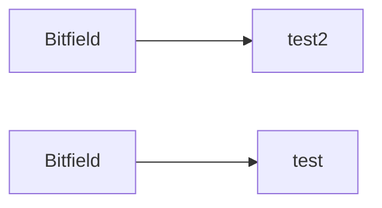

# Peer Protocols

This file documents some of the peer function workflows in tq. It follows the [Official BitTorrent specification](https://www.bittorrent.org/beps/bep_0003.html) with some implementation-specific deviations.

Bittorrent messages are assymetric: peers can send messages in both directions simultaneously. We therefore in general never really wait on messages. We have a global state

## Choking and Interest

Choking is a mechanism for clients to choose which peers which peers it is transfering to.

Peers maintain two bits of data on each side called _choked_ and _interested_ which can be modififed by sending `choke`, `unchoke`, `interested`, `not interested` messages. Connections start chocked and not interested.

- _Choking_ indicates that a peer is not going to send any data. So if we choke a peer, we will not send any data to it. If a peer chokes us, we will not receive any data from it.

- _Interest_ is a difference piece of state only used by downloaders. Interested indicates that a peer _would_ start downloading pieces, if they were unchoked.

A downloader might want to only unchoke the seeders with the best upload speeds, because having lots of slow open TCP connections degrades performance. An uploader might want to keep low-speed downloaders choked for the same reason.

The sample choking algorithm described in the specs goes as follows

> In the following, if we have the complete file, consider _rate_ to be our _upload_ rate. If we do not have the complete file, take rate to be _download_ rate.
>
> - Every 10 sconds
>   - Unchoke the four peers which are interested and have the best rates
>   - Peers which have a better rate but aren't interested get unchoked and if they become interested the worst peer gets choked.
> - Every 30 seconds
>   - One additional peer is unchoked, regardless of rate. New connections are three times as likely to start as the current optimistic unchoke as anywhere else in the rotation

## Establishing connection with a peer

- Get a (possibly refreshed) list of peer ip adresses from every tracker.

If we do not already have a connection with a peer, then:

Establish a TCP connection

- Perform a BitTorrent handshake

- Send `bitfield`

Else:

## Connection-level housekeeping

- Keep-alive messages every 2 minutes if idle.
- Drop peers that haven’t responded to anything in a long time.
- Support half-open TCP states gracefully

## Sending flow

- If we are choking them, return. If we were downloading or uploading a piece, reset all neccessary state.

- If the file is incomplete (Downloading loop)

  - Grab a piece from the global download queue if needed or keep working on the current piece
  - If the downloader does not have that piece (check bitfield), return (pushing the piece back to the piece queue)
  - Pipeline: if we have less than the max allowed pipelined requests, send subpiece `request` until we hit the limit

- Always runs (Seeding loop)

  - Keep grabbing partial pieces from the local request queue until messages sent is larger than seeding backlog and send `piece` messages for each one

## Receiving flow

TODO: receiving thread should not send stuff, instead set flags and let send thread send

- If receive choke: update their choking state
- If receive unchoke: update their choking state
- If receive interested: update their choking state
- If receive uninterested: update their choking state
- If receive have: update their bitfield, check interest status and send update if nec
- If receive bitfield: update their bitfield, check interest status and send update if nec
- If receive request: add to local request queue
- If receive piece: update subpiece queue, if this is the last subpiece, check integrity, send have if ok, and update the global download queue. Also check if we
- If receive cancel: update local request queue

## Choking algorithm

(TODO), very basic for now, we will implement a proper choking algorithm later

Unchoke everyone. Interest is handled by the have and bitfield callbacks

## Receiving workflow

